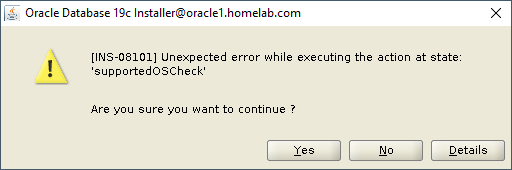


**Note:** This Guide is Production Ready.



## Prerequisites

### Install required X11 packages
Install X11 packages with following command based on your operating system release and version:

```bash
yum install xorg-x11-xauth -y
```
### Configure X11 forwarding

To enable X11 Forwarding, change the “X11Forwarding” parameter using vi or nano editor to `yes` in the `/etc/ssh/sshd_config` file if either commented out or set to no.

```bash
vi /etc/ssh/sshd_config
```
or 

```bash
nano /etc/ssh/sshd_config
```

You should see similar output as the following:

`X11Forwarding yes`

### Install the Dependencies


<details>

<summary>🛠️Install the Following🛠️</summary>

```bash
yum install libnsl* -y
yum install -y bc    
yum install -y binutils
yum install -y compat-libcap1
yum install -y compat-libstdc++-33
#yum install -y dtrace-modules
#yum install -y dtrace-modules-headers
#yum install -y dtrace-modules-provider-headers
yum install -y dtrace-utils
yum install -y elfutils-libelf
yum install -y elfutils-libelf-devel
yum install -y fontconfig-devel
yum install -y glibc
yum install -y glibc-devel
yum install -y ksh
yum install -y libaio
yum install -y libaio-devel
yum install -y libdtrace-ctf-devel
yum install -y libXrender
yum install -y libXrender-devel
yum install -y libX11
yum install -y libXau
yum install -y libXi
yum install -y libXtst
yum install -y libgcc
yum install -y librdmacm-devel
yum install -y libstdc++
yum install -y libstdc++-devel
yum install -y libxcb
yum install -y make
yum install -y net-tools # Clusterware
yum install -y nfs-utils # ACFS
yum install -y python # ACFS
yum install -y python-configshell # ACFS
yum install -y python-rtslib # ACFS
yum install -y python-six # ACFS
yum install -y targetcli # ACFS
yum install -y smartmontools
yum install -y sysstat
```

</details>

```bash
yum update -y
```
``` bash title="To check if Development Tools are installed"
yum grouplist
```

```bash title="If Development tools have not been installed"
yum group install "Development Tools"

```


### Create Oracle Groups and add user
```bash
groupadd -g 3001 oinstall
groupadd -g 3002 dba
groupadd -g 3003 oper
useradd -u 3001 -g oinstall -G dba,oper oracle
```

```bash
passwd oracle
```

### Create the required directories
```bash
mkdir -p /u01/app/oracle/product/19.3/db_home
```

### Change Ownership & Access Permissions
```bash
chown -R oracle:oinstall /u01
chmod -R 775 /u01
```

```bash title="Login with Oracle User"
su - oracle
```

```
export CV_ASSUME_DISTID=RHEL8.5
```

### Update the .bash_profile
```title="Using vi editor"
vi .bash_profile
```
```title="Using vi editor"
nano .bash_profile
```

Update the Bash Profile with the following:
```bash
export ORACLE_BASE=/u01/app/oracle
export ORACLE_HOME=/u01/app/oracle/product/19.3/db_home
export CLIENT_HOME=/u01/app/oracle/product/19.3/client
#export ORACLE_SID=CDB
export LD_LIBRARY_PATH=\$ORACLE_HOME/lib:$CLIENT_HOME/lib:/lib:/usr/lib
export CLASSPATH=\$ORACLE_HOME/jlib:\$ORACLE_HOME/rdbms/jlib:$CLIENT_HOME/rdbms/jlib$
export NLS_LANG=american_america.al32utf8
export NLS_DATE_FORMAT="yyyy-mm-dd:hh24:mi:ss"
export PATH=$PATH:$HOME/.local/bin:$ORACLE_HOME/bin:$CLIENT_HOME/bin
```
## 19c Installation

Download the Oracle 19c Software from Oracle's Offical Website Copy it to  `$ORACLE_HOME` location, unzip the software and run below cmd


```bash
./runInstaller
```


Oracle 19c DB Software Installation Wizard will appear.



If you encounter the following error, then run the following command!


```bash
export CV_ASSUME_DISTID=RHEL8.5
```




